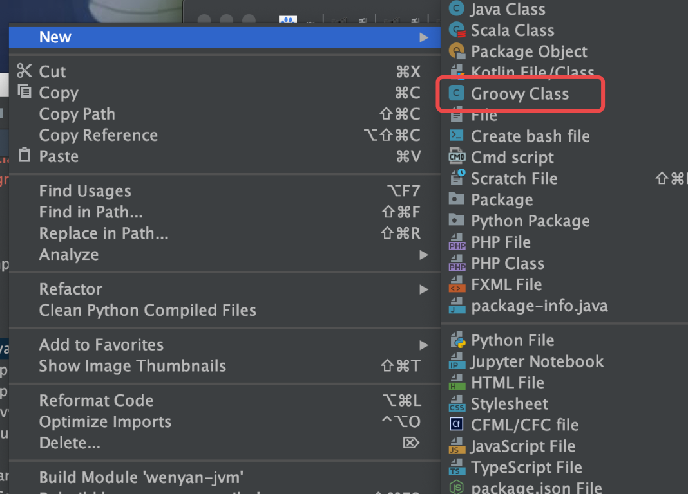

# NukkitLearn章外篇之三-Groovy

参与编写者: MagicLu550

##### 知识点:  groovy

### 关于groovy

Groovy是一种基于JVM（Java虚拟机）的敏捷开发语言，它结合了Python、Ruby和Smalltalk的许多强大的特性
，Groovy 代码能够与 Java 代码很好地结合，也能用于扩展现有代码。由于其运行在 JVM 上的特性，Groovy也可以使用其他非Java语言编写的库。

1、 构建在强大的Java语言之上 并 添加了从Python，Ruby和Smalltalk等语言中学到的 诸多特征，例如动态类型转换、闭包和元编程（metaprogramming）支持。

2、为Java开发者提供了 现代最流行的编程语言特性，而且学习成本很低（几乎为零）。

3、 支持DSL（Domain Specific Languages领域特定语言）和其它简洁的语法，让代码变得易于阅读和维护。

4、受检查类型异常(Checked Exception)也可以不用捕获。

5、 Groovy拥有处理原生类型，面向对象以及一个Ant DSL，使得创建Shell Scripts变得非常简单。

6、在开发Web，GUI，数据库或控制台程序时 通过 减少框架性代码 大大提高了开发者的效率。

7、支持单元测试和模拟（对象），可以 简化测试。

8、无缝集成 所有已经存在的 Java对象和类库。

9、直接编译成Java字节码，这样可以在任何使用Java的地方 使用Groovy。  

10、支持函数式编程，不需要main函数。

11、一些新的运算符。

12、默认导入常用的包。

13、断言不支持jvm的-ea参数进行开关。

14、支持对对象进行布尔求值。

15、类不支持default作用域，且默认作用域为public。

16、groovy中基本类型也是对象，可以直接调用对象的方法。

groovy的最吸引人的特性是闭包，动态和静态类型的兼容，流行语法。
java的大部分语法几乎可以直接在groovy上完美编译。

### 为什么我推荐使用groovy？
有些人可能认为，我们既然可以用java写，为什么还要费劲的再学个groovy呢？
原因很简单，但是问题的本身就是错的，因为再学会java的基础上，您几乎不需要
再去学习它了。`java的大部分语法几乎可以直接在groovy上完美编译。`这句话
是十分有用的，并且，最主要的是，他的语法不冗长，且表达力强。例如
```java
class Test{
    public Map<String,String> map = new HashMap();
}

```
等同于
```groovy
def map = [:] //动态类型
//或者
Map map1 = [:] //静态类型

```
很显然，我们可以看出，groovy就如同简化的java一样。而且，令人欣喜的，
它可以**无缝**的调用java。

### 导入环境
首先像往常一样创建maven项目(未来我们也会教授gradle)。

我们依然推荐使用groovy，在idea中，groovy的插件是直接支持的，所以我们不需要
另外安装插件。我们同时也不需要上官网安装groovy环境，因为官方已经提供了groovy-all
的jar包和编译的插件
jar包
```xml
<dependency>
            <scope>compile</scope>
            <groupId>org.codehaus.groovy</groupId>
            <artifactId>groovy-all</artifactId>
            <version>2.3.11</version>
        </dependency>
```
```xml
<dependency>
            <groupId>org.spockframework</groupId>
            <artifactId>spock-core</artifactId>
            <version>0.6-groovy-1.8</version>
            <scope>test</scope>
        </dependency>
```
编译的插件
```xml
 <plugin>
                <groupId>org.codehaus.gmaven</groupId>
                <artifactId>gmaven-plugin</artifactId>
                <version>1.3</version>
                <executions>

                    <execution>
                        <goals>
                            <goal>generateTestStubs</goal>
                            <goal>testCompile</goal>
                        </goals>

                        <configuration>
                            <debug>true</debug>
                            <verbose>true</verbose>
                            <stacktrace>true</stacktrace>
                            <defaultScriptExtension>.groovy</defaultScriptExtension>
                            <providerSelection>1.7</providerSelection>
                        </configuration>
                    </execution>

                </executions>
            </plugin>
```
如果先前存在了这个插件，请以此为模板添加
```xml
 <plugin>
                <groupId>org.apache.maven.plugins</groupId>
                <artifactId>maven-compiler-plugin</artifactId>
                <version>3.2</version>
                <configuration>
                    <source>1.8</source>
                    <target>1.8</target>
                    <encoding>UTF-8</encoding>
                </configuration>
                <dependencies>
                    <dependency>
                        <groupId>org.codehaus.groovy</groupId>
                        <artifactId>groovy-eclipse-compiler</artifactId>
                        <version>2.9.1-01</version>
                    </dependency>
                    <!-- for 2.8.0-01 and later you must have an explicit dependency on groovy-eclipse-batch -->
                    <dependency>
                        <groupId>org.codehaus.groovy</groupId>
                        <artifactId>groovy-eclipse-batch</artifactId>
                        <version>2.3.7-01</version>
                    </dependency>
                </dependencies>
            </plugin>
```
这样，我们的groovy开发环境就建好了。

### 创建groovy类

创建groovy类和创建java类基本是一样的，只是我们需要选择groovy的文件创建

即可创建了groovy类

### groovy的语法标准
[groovy的官方网站](http://www.groovy-lang.org)里面有groovy的文档(Document),
可以参见[语法规则](http://www.groovy-lang.org/syntax.html)等。

### 在nukkit上使用
如同往常一样创建类，只是语法上可以简略一些.并且可以和java代码共存
```groovy
package net.noyark.nukkit

import cn.nukkit.plugin.PluginBase

class ShareInventoryPlugin extends PluginBase {


    @Override
    void onLoad() {
        this.logger.info("hello")
    }

    @Override
    void onEnable() {

    }

    @Override
    void onDisable() {

    }
}
```
