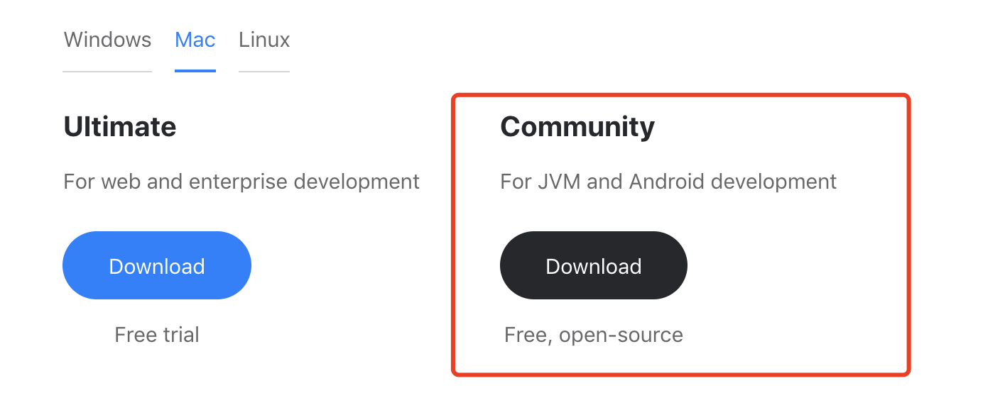
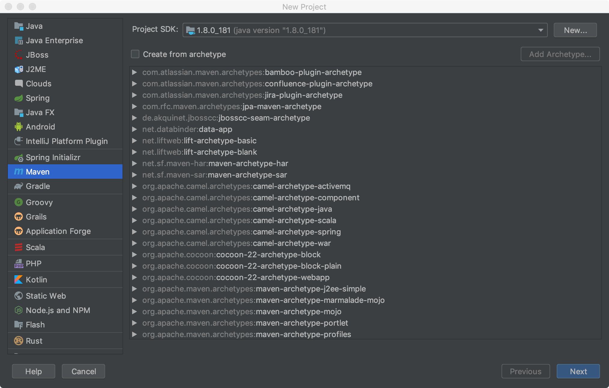

# 第一章如何搭建环境
#### 建议学习时间: 40分钟
##### 学习要点: 学会使用idea搭建maven环境和nukkit开发环境,并学习调试nukkit项目

搭建环境是我们使用nukkit的第一步，它虽然不是必要的一步，但是是我们进行简便开发的第一步。

1. 首先上[idea官网](https://www.jetbrains.com/idea/download/#section=mac)下载我们所需要的版本，我们
一般选择免费的Community版本，当然您也可以选择购买Ultimate版本,Community版本其实已经符合我们使用的需求，当然
作者使用的是Ultimate版本在此教学。


2.打开idea后，我们这里使用[maven](https://maven.apache.org/)项目进行构建,这里使用[jdk1.8](https://www.oracle.com/technetwork/java/javase/downloads/jdk8-downloads-2133151.html)，为这些选项即可


3.输入完groupId和artifactId(这些是自定义的)，创建项目后，我们会进入这个界面,这里我artifactId为MyFirstPlugin


4. 在pom.xml中加入以下标签可以导入

```xml
<distributionManagement>
        <repository>
            <id>releases</id>
            <name>nukkitx-releases</name>
            <url>https://repo.nukkitx.com/release</url>
        </repository>
        <snapshotRepository>
            <id>snapshots</id>
            <name>nukkitx-snapshots</name>
            <url>https://repo.nukkitx.com/snapshot</url>
        </snapshotRepository>
    </distributionManagement>

    <repositories>
        <repository>
            <id>nukkitx-repo</id>
            <name>nukkitx-snapshot</name>
            <url>https://repo.nukkitx.com/snapshot</url>
        </repository>
    </repositories>
```

如图所示


- 参考文献 [[教程] [官方] 使用Maven配置Nukkit开发环境的方法（部分）](https://www.mcbbs.net/thread-706178-1-1.html)
- 