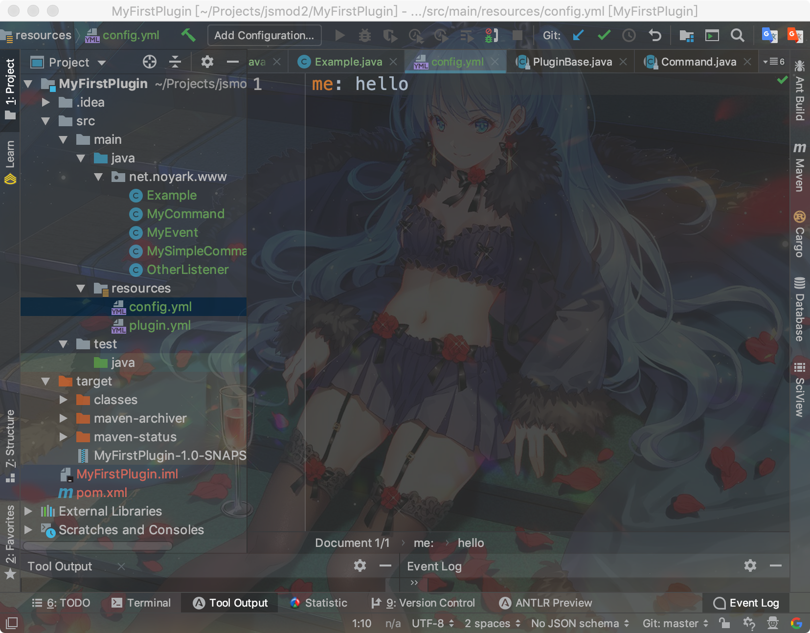
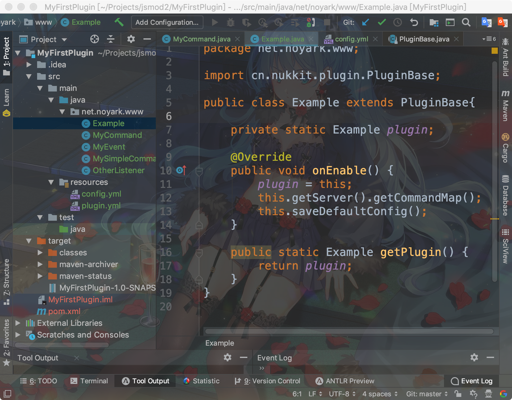
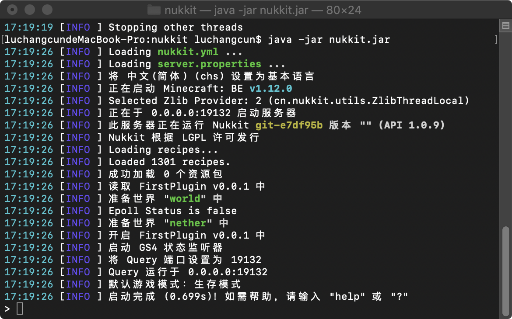
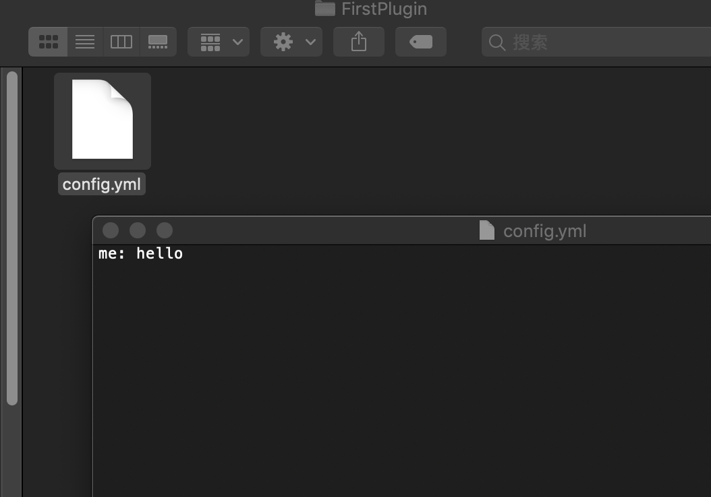

[上一章](第四章*如何编写命令.md) [下一章](第六章*如何编写plugin.yml.md)
# 第一部分 第五章 如何编写配置文件
参与编写者: MagicLu550
#### 建议学习时间: 40分钟
##### 学习要点: 了解如何创建配置文件，了解使用SimpleConfig

配置文件用于存储插件的配置信息，供用户自定义和修改，以及存储一些永久数据，我们称
配置文件属于 **持久层**。

nukkit提供了多种配置文件格式，如yaml,json,properties等，其中最常用的是yaml,
我们主要讲解这个配置文件格式，其他如果想要了解，可以发送issues，我们可以补充。

1. 关于yaml

nukkit的yaml框架基于[snakeYaml](https://github.com/bmoliveira/snake-yaml)实现的,
snakeYaml是一款使用广泛的yaml解析库,我们可以从它的[官网](https://yaml.org/type/index.html)了解
他们的语法，在nukkit开发中，我们更多使用key: value的映射形式

这是一个yaml的文件案例
```yaml
server:
 name: 12
 player:
  - nihao
  - xiaoming
  - xiaogang
 time:
  year: 2019
```
yaml的标准语法是使用空格来划分级别，前面为键，后面为值，且值和冒号之间有空格，
虽然yaml的语法不止如此简单，但是我们最常用的也就这些很简单的东西。

yaml的数组有两个表示形式
```yaml
array1: ["1","2"] #yaml的注释
array2: [1,2] #yaml不允许有重复的键
array3:
 - 1
 - 2
 - 3

```
如果还要了解其他，可以上yaml官网查看他们语法，这里只讲解这些语法

2. 如何使用nukkit的配置文件库

原本的snakeYaml使用起来比较复杂，因此nukkit官方提供了简化,同一
使用Config对象来表达和操作。

使用默认的配置

默认配置文件为config.yml,可以通过saveDefaultConfig()方法来实现，
前提是你的resources下面要创建一个config.yml,这个方法会默认在
plugins/${你的插件名字}下创建一个config.yml,并且会把resources下面的那个
config.yml内容复制过来.

之后我们调用这个方法即可

我们这里打开一个服务器，做一个实验可以看看,插件名为FirstPlugin

我们插件被加载成功,我们看看我们的文件夹

发现.../plugins/FirstPlugin下面出现了一模一样的config.yml

[上一章](第四章*如何编写命令.md) [下一章](第六章*如何编写plugin.yml.md)
